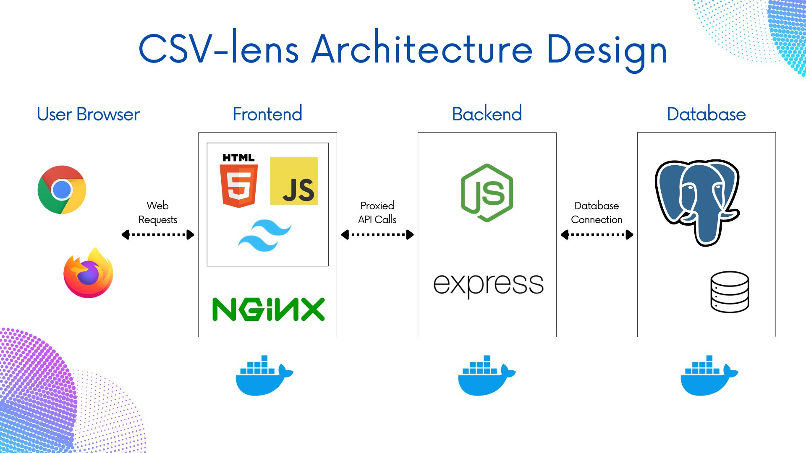

# CSV-lens


**CSV-lens** is a full-stack web application for uploading, viewing, and analyzing CSV data directly in your browser.

## Table of Contents

- [Features](#features)
- [Demo](#demo)
- [Installation](#installation)
- [Technologies Used](#technologies-used)
- [Architecture](#architecture)
- [Data Pipeline (etl-perspective)](#data-pipeline-etl-perspective)
- [Contributing](#contributing)
- [License](#license)

## Features

- User Authentication & Session Management
- CSV files Upload
- Automatic Data Type Inference
- Interactive Table View: Display uploaded CSV data in a dynamic, scrollable table.

- Advanced Data Exploration:

    - Filtering and Sorting

    - Null Row Detection: Dedicated table for rows with missing (null) values for quick data quality assessment.

    - In-Table Editing: Directly edit individual cell values within the displayed table.

- Data Visualization: Generate interactive graphs and charts using Plotly.js

- Dataset Management:

    - Search functionality to quickly find uploaded datasets.

    - Pagination for efficient browsing of large lists of datasets.

    - Ability to delete uploaded datasets.

- Data Export: Download processed and filtered data back to CSV or JSON format.

- Graphs Export: Download graphs and charts as png or svg format.

- Responsive User Interface: Designed to provide a consistent experience across various devices.

## Demo
A video demo will be added soon. For now, clone the repo and follow the installation steps to explore locally.

Register, Login, and are required to reach the main page (not shown in video).

## Installation
### Prerequisites

[Docker Desktop](https://www.docker.com/products/docker-desktop/) (includes Docker Engine and Docker Compose) installed on your system.

1. **Clone the Repository**
```bash
git clone https://github.com/ISE-S46/CSV-lens.git
cd CSV-lens
```
2. **Configure Environment Variables**:
Create a .env file in the root directory of the project (where docker-compose.yaml is located). 

    Create .env file with content:
    #### Replace placeholder values with strong, random strings for COOKIE_SECRET, JWT_SECRET, and REFRESH_TOKEN_SECRET
```bash
DB_USER=your_DB_user
DB_PASSWORD=your_DB_password
DB_NAME=your_DB_name
DB_PORT=your_DB_port
DB_HOST=database # Based on docker-compose service name

SERVER_PORT=3002 # Internal port for Node.js backend

NODE_ENV=production
COOKIE_SECRET=your_super_secret_cookie_key_here
COOKIE_MAX_AGE=900000 # 15 * 60 * 1000 (15 minutes) or change to what ever you want
REFRESH_COOKIE_MAX_AGE=172800000 # 2 * 24 * 60 * 60 * 1000 (2 days) or change to what ever you want

JWT_EXPIRES_IN=15m # Or change to what ever you want
JWT_SECRET=your_super_secret_JWT_key_here

REFRESH_TOKEN_EXPIRES_IN=2d # Or change to what ever you want
REFRESH_TOKEN_SECRET=your_refresh_token_secret_key_here

API_BASE_URL=/api # for Nginx proxying, use this or change to what ever you want
```
3. **Configure config.js**:
Create config.js file at /Frontend
```bash
cd Frontend
```
```js
export const API_BASE_URL = '/api'; // must be the same as API_BASE_URL in .env
```
```bash
cd ..
```
4. **Build and Run the Containers**: Navigate to the root directory of your project in your terminal and run:

```bash
docker-compose up --build -d
```
It might take a few minutes for all services to start, especially the database and for initial Node.js dependencies to install.

5. **Access the Application**

Once all containers are up and running, open your web browser and navigate to: 

[http://localhost/](http://localhost/)

You can use the CSV files in /Test/Databasetest/ to test this project full capabilities.


## Technologies Used

- **Frontend**: 
    - HTML
    - CSS
        - Tailwind CSS
    - JavaScript (ES6)
    - [Plotly.js](https://plotly.com/javascript/) (for data visualization)
- **Backend**: 
    - Node.js
    - Express.js
- **Database**: 
    - PostgreSQL
- **Containerization**:
    - Docker
- **Testing** (For more detail please check [Test Guide](Test/TestGuide.md)):
    - Jest
    - jsdom
    - babel
    - Supertest

## Architecture

- **User Browser**: The client-side interface where users interact with the application.
- **Frontend (Containerized)**:
    - HTML, JavaScript, Tailwind CSS: Provides the user interface and client-side logic.

    - Nginx: Serves static frontend assets (HTML, CSS, JS) and acts as a reverse proxy, forwarding API requests to the Backend.

    - Docker: The Frontend is packaged into a Docker container for isolated execution.

- **Backend (Containerized)**:
    - Node.js with Express.js: Handles all API endpoints, authentication, and data processing.

    - Docker: The Backend is also packaged into a Docker container.

- **Database (Containerized)**:

    - PostgreSQL: The primary data store for user information and all uploaded CSV data.

    - Docker: The Database runs in its own Docker container.

Communication between containers happens over an internal Docker network, while the User Browser interacts with Nginx on exposed ports.

## Data Pipeline (ETL Perspective)

The project's data flow can be understood through the lens of an Extract, Transform, Load (ETL) pipeline, showcasing how CSV data is processed from raw input to interactive analysis.


## Contributing

Contributions are welcome! If you have suggestions for improvements, new features, or bug fixes, please feel free to fork the repository and open a pull request.

## License

See [LICENSE](LICENSE) file for details.